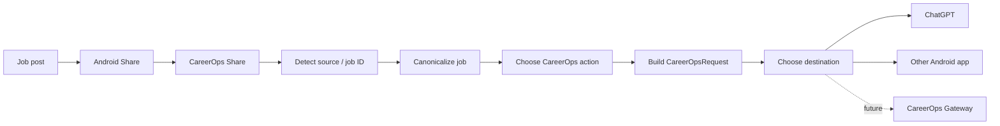
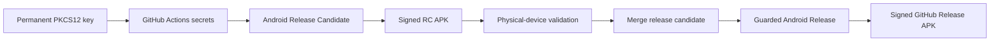

# CareerOps Share for Android

CareerOps Share is the Android intake edge for the CareerOps job-application pipeline. It appears in the Android Sharesheet, converts a shared job posting into a structured CareerOps request, and sends that request through a user-selected local destination.

**Published release:** `0.2.0`  
**Current signing work:** stable release-signing infrastructure on `chore/stable-release-signing`

## v0.2 application overview

v0.2 changed CareerOps Share from a ChatGPT-specific forwarding utility into a provider-neutral smart intake client.

It includes:

- structured job intake,
- LinkedIn/Indeed job-ID extraction,
- canonical URL generation,
- safe tracking/share-parameter cleanup,
- CareerOps action selection,
- persistent local defaults,
- destination profiles,
- transport abstraction,
- ChatGPT as one destination rather than a hard-coded architecture dependency,
- Android system chooser as a first-class destination,
- structured text and JSON request rendering,
- JVM unit tests,
- architecture/request-schema documentation.

The app remains intentionally **local-only** in v0.2. HTTP/API/Webhook delivery is designed into the boundary but not enabled yet.

## User flow



## CareerOps actions

- **Analyze**
- **Analyze + Build & Store**
- **Analyze + Build & Store + Cover Letter**

The selected action and destination are stored locally as defaults.

## Destinations

Enabled destinations:

- **ChatGPT** — direct Android package target.
- **Choose Android app…** — standard Android chooser and therefore compatible with other apps that accept `ACTION_SEND`.

Future transport types can include explicitly supported Android AI clients, deep links/web clients, HTTP POST, webhooks, or the CareerOps Gateway.

See [`docs/DESIGN.md`](docs/DESIGN.md) and [`docs/REQUEST_SCHEMA.md`](docs/REQUEST_SCHEMA.md).

## Stable GitHub Release signing

The repository is moving GitHub Releases to one permanent CareerOps Share signing identity and signed **release APKs** instead of debug APKs.



The private keystore and passwords are never committed. Gradle reads signing credentials from environment variables supplied by GitHub Actions secrets. The workflow verifies the final APK with Android `apksigner` and reports the signer SHA-256 fingerprint.

Full setup and backup instructions:

[`docs/SIGNING.md`](docs/SIGNING.md)

Full release-candidate flow:

[`docs/RELEASE_CHECKLIST.md`](docs/RELEASE_CHECKLIST.md)

### Rollout order

The signing workflows first have to exist on `main` so GitHub can expose **Android Release Candidate** as a manual workflow. After this infrastructure PR merges:

1. create/back up the permanent key and configure GitHub Actions secrets,
2. create the first stable-signing release-candidate branch (planned `0.2.1` / versionCode `4`),
3. run **Android Release Candidate** from that branch,
4. validate the signed APK on the physical device and record the signer fingerprint,
5. merge the release candidate,
6. run the guarded signed release workflow.

### Signing-transition note

The previous v0.1.1/v0.2.0 builds used debug signing. The first stable-signed APK will normally require a **one-time uninstall/reinstall** when crossing to the new permanent certificate. Future stable-signed versions can upgrade normally as long as the permanent keystore is preserved.

## Privacy / permissions

v0.2 has:

- no `INTERNET` permission,
- no storage permission,
- no GitHub credential,
- no model-provider API key,
- no background network task.

It only receives text explicitly shared by the user and sends/copies data after a user action.

## Build configuration

- Android Gradle Plugin: 9.3.0
- Gradle distribution: 9.5.0
- compileSdk / targetSdk: 36
- minSdk: 26
- Java: 17+
- Kotlin: AGP 9 built-in Kotlin
- current versionCode: 3
- current versionName: 0.2.0

## Development build

Normal development and CI continue to use debug builds and do not require the permanent signing key.

```powershell
.\gradlew.bat clean test assembleDebug
```

Debug APK:

```text
app\build\outputs\apk\debug\app-debug.apk
```

## Signed release-candidate build

Once the signing infrastructure is merged and repository signing secrets are configured, the canonical signed RC is produced by:

**Actions → Android Release Candidate → Run workflow**

Select the release-candidate branch in **Use workflow from**. The workflow:

1. runs tests,
2. builds `assembleRelease`,
3. signs with the permanent CareerOps Share key,
4. verifies the APK with `apksigner`,
5. reports the signer SHA-256 fingerprint,
6. uploads a short-lived signed RC artifact for physical-device testing,
7. does **not** create a tag or release.

## GitHub Actions and Releases

- `.github/workflows/android-ci.yml` — ordinary tests/debug build for pushes and PRs.
- `.github/workflows/android-release-candidate.yml` — manual signed RC build for device validation.
- `.github/workflows/android-release.yml` — guarded signed final release from current `main`.

The final release workflow requires confirmations for:

- PR merged,
- signed physical-device validation,
- `VALIDATION.md` updated,
- green `main` CI,
- permanent signer fingerprint verified,
- checklist/release notes reviewed.

It also automatically verifies the version/tag, signing secrets, keystore/alias, tests, signed `assembleRelease`, APK signature, SHA-256, and release assets.

Final stable release assets use:

```text
CareerOpsShare-vX.Y.Z.apk
CareerOpsShare-vX.Y.Z.apk.sha256
CareerOpsShare-vX.Y.Z-signing-certificate.txt
```

Generated APKs and signing material belong outside Git history.

## Device acceptance checklist

Test at minimum:

- CareerOps Share appears in Android Sharesheet.
- LinkedIn source/job ID/canonical URL are correct.
- Indeed source/`jk`/canonical URL are correct.
- all three CareerOps actions regenerate correctly.
- action preference persists.
- destination preference persists.
- ChatGPT destination launches ChatGPT.
- system chooser works.
- missing explicit app target falls back safely.
- editable request can still be copied and sent.
- JSON request can be copied.

Record candidate results and the signer SHA-256 fingerprint in [`VALIDATION.md`](VALIDATION.md).

## Roadmap

### v0.1.1 — validated transport baseline

Android share → CareerOps payload → ChatGPT.

### v0.2.0 — smart intake + provider-neutral routing

Structured intake, actions, destination profiles, local transports, JSON schema.

### v0.2.1 — planned stable-signing transition

Permanent release certificate, signed RC workflow, signed GitHub Release APKs.

### v0.3.0 — authenticated network transport

Planned: HTTPS POST/webhook transport, secure endpoint configuration, authentication, timeout/retry semantics, request IDs, acknowledgement/status handling, duplicate-submission protection, and optional offline queue.

### Later — CareerOps control-plane integration

CareerOps Gateway → Agent Control Plane → Model Broker → selected worker model(s) → results.
