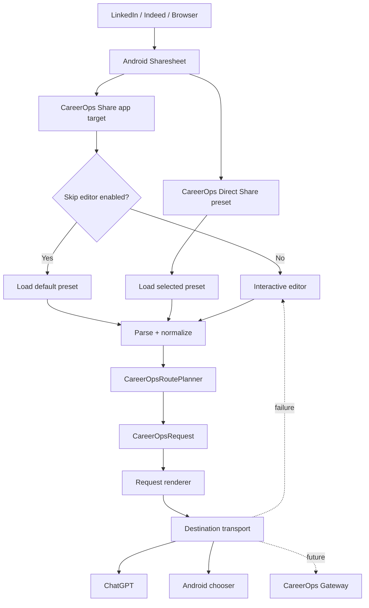

# CareerOps Share for Android

CareerOps Share is the Android intake edge for the CareerOps job-application pipeline. It appears in the Android Sharesheet, normalizes shared job postings, builds a structured CareerOps request, and routes that request through a selected local destination.

**Published stable release:** `0.2.1`  
**Current development:** `0.3.0` / versionCode `5` on `feature/v0.3.0-direct-share-presets`

## v0.3.0 — Direct Share / Preset Routing

v0.3 adds preset-driven fast paths without coupling CareerOps Share to one AI vendor or model.

Built-in presets:

- **Quick Analyze** → `ANALYZE`
- **Build & Store** → `ANALYZE_BUILD_STORE`
- **Full Application** → `ANALYZE_BUILD_STORE_COVER_LETTER`

Each preset stores:

- CareerOps action,
- destination,
- model preference,
- request profile,
- auto-forward behavior,
- whether it is published as an Android Direct Share target.

The initial destinations remain:

- **ChatGPT** — explicit Android app destination.
- **Choose Android app…** — Android system chooser.

The app remains local-only in v0.3. HTTP/API/Webhook delivery is still intentionally disabled.

## Share behavior

v0.3 supports three paths.



### Normal CareerOps Share target

By default, selecting **CareerOps Share** still opens the editor. The user can enable:

> Skip editor for normal shares (use default preset)

When enabled, a normal share is parsed, rendered, and forwarded with the saved default preset before the editor UI is built.

### Direct Share preset

Android Sharing Shortcuts publish enabled CareerOps presets into the Direct Share row. Selecting one provides the preset shortcut ID with the incoming `ACTION_SEND`; CareerOps Share resolves that preset and routes immediately.

The app uses the modern Sharing Shortcuts mechanism rather than the deprecated `ChooserTargetService` path.

## Preset editing

The in-app control panel can:

- choose a preset,
- set the selected preset as default,
- enable/disable normal-share auto-forward,
- choose CareerOps action,
- choose destination,
- choose model preference,
- choose CareerOps Standard text vs CareerOps JSON request profile,
- show/hide a preset in Android Direct Share,
- save and republish preset shortcuts.

Preset storage remains in local `SharedPreferences` for this first v0.3 implementation. The storage boundary is isolated so custom user-created presets can migrate to DataStore later without changing the route planner.

## Model preference

`ModelPreference` is intentionally separate from `DestinationProfile`.

Android can reliably select a destination app, but an Android share intent generally cannot force the internal model selected inside ChatGPT or another AI client. In v0.3 the preference is therefore saved as routing metadata for future use.

The future CareerOps Gateway / Model Broker can enforce model routing server-side without changing Android preset semantics.

## Core architecture

```text
Incoming ACTION_SEND
        ↓
IncomingShareReader
        ↓
ShareParser
        ↓
JobShareIntake
        ↓
CareerOpsPreset
        ↓
CareerOpsRoutePlanner
        ↓
CareerOpsRequest
        ↓
CareerOpsRequestRenderer
        ↓
DestinationProfile
        ↓
TransportRegistry
        ↓
AndroidAppTransport / AndroidChooserTransport
```

See [`docs/DESIGN.md`](docs/DESIGN.md) and [`docs/REQUEST_SCHEMA.md`](docs/REQUEST_SCHEMA.md).

## CareerOps request contract

The Android application version and request-schema version are independent.

- Android app: `0.3.0` development
- CareerOps request schema: `1.0`

The request itself remains transport-neutral. Preset destination and model-routing metadata are not required to mutate the CareerOps request schema.

## Privacy / permissions

v0.3 still has:

- no `INTERNET` permission,
- no storage permission,
- no GitHub credential,
- no model-provider API key,
- no background network task.

The app only processes content explicitly shared by the user and routes it through local Android intents.

## Stable release signing

v0.2.1 established the permanent CareerOps Share release signing identity.

The private PKCS12 keystore and passwords are never committed. GitHub Actions materializes the key temporarily from repository secrets, builds `assembleRelease`, verifies the APK with `apksigner`, reports the signer SHA-256 fingerprint, publishes the signed APK/checksum/certificate record, then removes the temporary runner keystore.

Permanent signer SHA-256 established by v0.2.1:

```text
e77ad35df3c7444a8573693e4d83892a871c06cedebb7c21214f3fa55a9158d9
```

See:

- [`docs/SIGNING.md`](docs/SIGNING.md)
- [`docs/RELEASE_CHECKLIST.md`](docs/RELEASE_CHECKLIST.md)

The v0.3 feature branch does not change the release-signing identity or release workflow.

## Build configuration

- Android Gradle Plugin: 9.3.0
- Gradle distribution: 9.5.0
- compileSdk / targetSdk: 36
- minSdk: 26
- Java: 17+
- Kotlin: AGP 9 built-in Kotlin
- development versionCode: 5
- development versionName: 0.3.0

## Development build

```powershell
.\gradlew.bat clean test assembleDebug
```

Debug APK:

```text
app\build\outputs\apk\debug\app-debug.apk
```

## v0.3 device acceptance targets

Before v0.3 can merge/release, validate at minimum:

- ordinary CareerOps Share target still appears,
- interactive review path still works,
- Quick Analyze / Build & Store / Full Application presets can be saved,
- selected default preset persists,
- normal-share skip-editor setting persists,
- enabled preset shortcuts surface in Android Direct Share,
- each Direct Share preset routes the correct CareerOps action,
- ChatGPT direct destination works,
- system chooser destination works,
- failed direct route falls back to the interactive editor,
- CareerOps Standard and CareerOps JSON request profiles render correctly,
- model preference persists without falsely claiming to switch the destination app's internal model,
- v0.2.1 stable-signed install upgrades normally to a v0.3 RC signed by the same permanent key.

Record signed-RC results in [`VALIDATION.md`](VALIDATION.md) before release.

## UI backlog

Tracked separately from the routing core:

- **#5** — theme controls: light, dark, system, optional scheduled behavior.
- **#6** — edge-to-edge/system-bar behavior: status bar, navigation bar, gesture/3-button navigation, transient bars and insets.

These can be developed on v0.3 after the routing baseline is stable, but are not prerequisites for proving Direct Share architecture.

## Roadmap

### v0.1.1 — validated transport baseline

Android share → CareerOps payload → ChatGPT.

### v0.2.0 — smart intake + provider-neutral routing

Structured intake, actions, destination profiles, local transports, JSON schema.

### v0.2.1 — permanent signing identity

Permanent release certificate, signed RC workflow, guarded signed GitHub Release APKs.

### v0.3.0 — Direct Share / Preset Routing

Preset model/editor, default route, optional normal-share auto-forward, Android Sharing Shortcuts, request profiles, model-preference metadata, fast routing and interactive fallback.

### v0.4.0 — CareerOps Gateway / HTTPS transport

Planned: authenticated HTTPS POST/webhook transport, endpoint configuration, request IDs, acknowledgement/status, timeout/retry behavior, duplicate-submission protection and optional offline queue.

### Later — control-plane / model broker integration

CareerOps Gateway → Agent Control Plane → Model Broker → selected worker model(s) → results.
