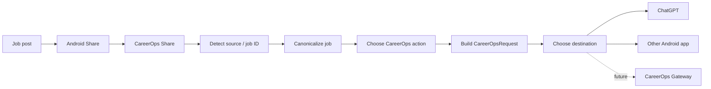

# CareerOps Share for Android

CareerOps Share is the Android intake edge for the CareerOps job-application pipeline. It appears in the Android Sharesheet, converts a shared job posting into a structured CareerOps request, and sends that request through a user-selected local destination.

**Current development version:** `0.2.0` on `feature/v0.2-smart-intake`  
**Validated stable baseline:** `0.1.1`

## v0.2 goals

v0.2 changes CareerOps Share from a ChatGPT-specific forwarding utility into a provider-neutral smart intake client.

It adds:

- structured job intake,
- LinkedIn/Indeed job-ID extraction,
- canonical URL generation,
- safe tracking/share-parameter cleanup,
- CareerOps action selection,
- persistent local defaults,
- destination profiles,
- transport abstraction,
- ChatGPT as one destination rather than a hard-coded architecture dependency,
- Android system chooser as a first-class destination,
- structured text and JSON request rendering,
- JVM unit tests,
- architecture/request-schema documentation.

v0.2 remains intentionally **local-only**. HTTP/API/Webhook delivery is designed into the boundary but not enabled yet.

## User flow



## CareerOps actions

v0.2 supports:

- **Analyze**
- **Analyze + Build & Store**
- **Analyze + Build & Store + Cover Letter**

The selected action is stored locally as the next default.

## Destinations

v0.2 enabled destinations:

- **ChatGPT** — direct Android package target.
- **Choose Android app…** — standard Android chooser and therefore compatible with other apps that accept `ACTION_SEND`.

The destination is stored independently from the CareerOps action.

Future destinations can use other transport types without changing the intake model, including another explicitly supported Android AI client, deep link/web client, HTTP POST, webhook, or CareerOps Gateway.

See [`docs/DESIGN.md`](docs/DESIGN.md).

## Request contract

CareerOps Share now creates a transport-neutral `CareerOpsRequest`.

The text renderer preserves the existing compatibility trigger:

```text
Analyze this job using CareerOps:
```

and adds structured fields such as action, source, job ID, and canonical URL.

The same request can also be copied as JSON. See [`docs/REQUEST_SCHEMA.md`](docs/REQUEST_SCHEMA.md).

## Architecture rule

The Android client owns intake, CareerOps action, destination, and transport.

The future CareerOps control plane/model broker should generally own final model selection. GPT, Claude, Gemini, local models, or future providers can then be changed or routed server-side without requiring a new Android application release.

## Privacy / permissions

v0.2 has:

- no `INTERNET` permission,
- no storage permission,
- no GitHub credential,
- no model-provider API key,
- no background network task.

It only receives text explicitly shared by the user and sends/copies data after a user action.

## Build configuration

- Android Gradle Plugin: 9.3.0
- Gradle distribution: 9.5.0
- compileSdk / targetSdk: 36
- minSdk: 26
- Java: 17+
- Kotlin: AGP 9 built-in Kotlin
- v0.2 versionCode: 3
- v0.2 versionName: 0.2.0

## Build in Android Studio

For v0.2 development, check out:

```bash
git fetch origin
git switch feature/v0.2-smart-intake
git pull
```

Then in Android Studio:

1. allow Gradle sync,
2. use JDK 17+,
3. keep Android SDK Platform 36 installed,
4. build/run the `app` configuration on the device.

CLI equivalent:

```bash
./gradlew clean test assembleDebug
```

APK:

```text
app/build/outputs/apk/debug/app-debug.apk
```

## v0.2 device acceptance checklist

Test at minimum:

- LinkedIn job share identifies LinkedIn.
- LinkedIn job ID is extracted.
- LinkedIn URL is canonicalized.
- Indeed `jk` is extracted.
- Indeed share/tracking noise is removed from the canonical URL.
- **Analyze** renders correctly.
- **Analyze + Build & Store** renders correctly.
- **Analyze + Build & Store + Cover Letter** renders correctly.
- selected action persists across launches.
- selected destination persists across launches.
- ChatGPT destination opens ChatGPT.
- system chooser opens other Android destinations.
- ChatGPT-unavailable flow falls back to chooser.
- **Copy** copies the editable text request.
- **Copy request JSON** copies schema v1.0 JSON.
- existing Sharesheet receiver behavior remains functional.

Do not merge the v0.2 branch to `main` or tag `v0.2.0` until this device acceptance gate passes.

## Tests

JVM unit tests live under:

```text
app/src/test/java/com/careerops/share/
```

Run:

```bash
./gradlew test
```

The Android-independent smoke test remains under `tools/ShareParserSmokeTest.kt`.

## GitHub Actions and Releases

- `.github/workflows/android-ci.yml` tests/builds pushes to `main` and pull requests targeting `main`.
- `.github/workflows/android-release.yml` tests/builds a version tag and publishes the APK plus SHA-256 to GitHub Releases.

After v0.2 passes physical-device validation:

1. merge `feature/v0.2-smart-intake` to `main`,
2. confirm CI passes on `main`,
3. create/run release tag `v0.2.0`,
4. verify the release APK on-device.

## Roadmap

### v0.1.1 — validated transport baseline

Android share → CareerOps payload → ChatGPT.

### v0.2.0 — smart intake + provider-neutral routing

Structured intake, actions, destination profiles, local transports, JSON schema.

### v0.3.0 — authenticated network transport

Planned: HTTPS POST/webhook transport, secure endpoint configuration, authentication, timeout/retry semantics, request IDs, acknowledgement/status handling, duplicate-submission protection, and optional offline queue.

### Later — CareerOps control-plane integration

CareerOps Gateway → Agent Control Plane → Model Broker → selected worker model(s) → results.
