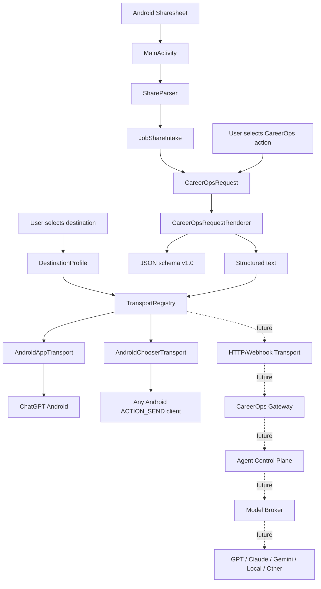
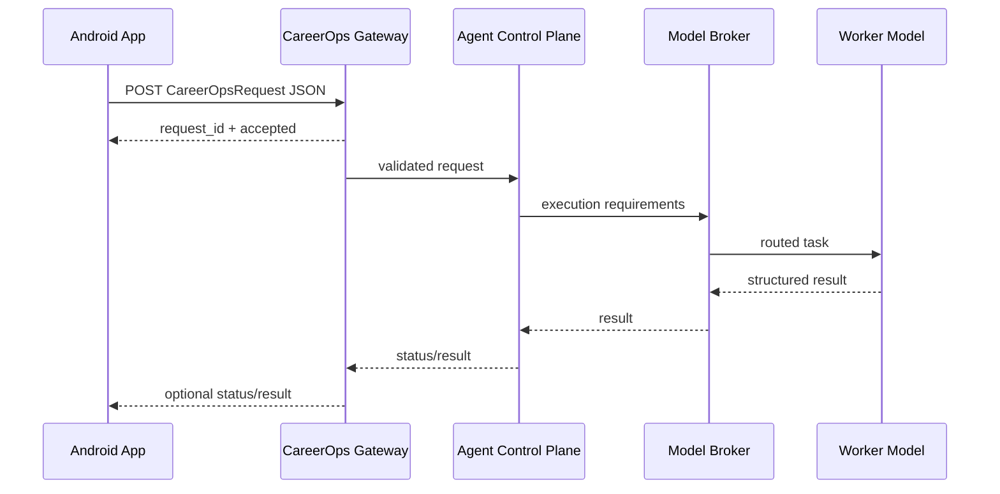

# CareerOps Share — Architecture and Design

## Purpose

CareerOps Share is the Android-side intake edge for CareerOps. It receives content explicitly shared by the user, normalizes job metadata, creates a versioned CareerOps request, and routes the rendered request to a user-selected destination.

The application intentionally separates:

1. **What CareerOps should do** — `CareerOpsAction`
2. **What request is being sent** — `CareerOpsRequest`
3. **Where the request goes** — `DestinationProfile`
4. **How it gets there** — `CareerOpsTransport`
5. **Which model ultimately executes work** — future CareerOps control-plane responsibility

This prevents the Android application from being coupled to one AI vendor, one Android app, or one model.

## v0.2 architecture

## Separation of concerns

### Intake

`ShareParser` is Android-independent. It accepts shared subject/text, caps extremely large input, extracts the first HTTP(S) URL, identifies known job sources, extracts source job IDs where supported, produces canonical URLs, removes known tracking/share parameters where safe, and preserves the original shared content as evidence.

### Request contract

`CareerOpsRequest` is transport-neutral and currently uses schema version `1.0`.

The request does **not** contain the selected Android destination. A CareerOps request describes the work; the destination describes delivery.

This separation is important because a future CareerOps gateway may route the same request through different models without changing the Android payload.

### Rendering

`CareerOpsRequestRenderer` has two representations:

- **Text** — compatibility format for LLM chat applications. It retains `Analyze this job using CareerOps:`.
- **JSON** — structured schema intended for future gateways, webhooks, automation, testing, and inter-process handoff.

### Destinations

A `DestinationProfile` contains a stable destination ID, human-readable name, transport type, Android package name when applicable, endpoint URL when applicable, and enabled state.

v0.2 ships two enabled local destinations:

- ChatGPT Android
- Android system chooser

A disabled `CAREEROPS_GATEWAY_FUTURE` profile documents the future HTTP boundary without enabling network behavior.

### Transports

`CareerOpsTransport` is the delivery interface.

v0.2 implements:

- `AndroidAppTransport`
- `AndroidChooserTransport`

`TransportType.HTTP_POST` is defined for forward compatibility, but `TransportRegistry` deliberately returns no implementation for it in v0.2.

## Security boundary

v0.2 remains local-only:

- no `INTERNET` permission,
- no API keys,
- no GitHub token,
- no model-provider credentials,
- no background network activity,
- no direct repository mutation.

The user explicitly initiates every share and every send.

## Future transport design

The Android client should generally select the **destination**, not the underlying worker model. Model selection belongs in the control plane so new providers/models can be added without requiring a mobile app release.

## Versioning

Two versions matter:

- Android application version — e.g. `0.2.0`
- CareerOps request schema version — currently `1.0`

They are intentionally independent.
