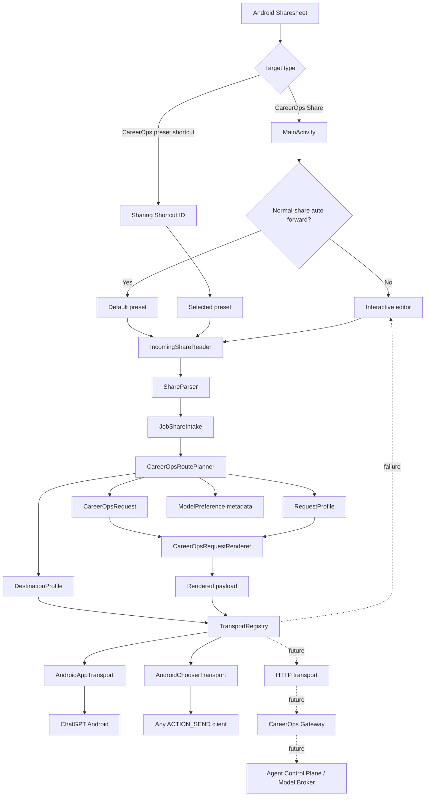
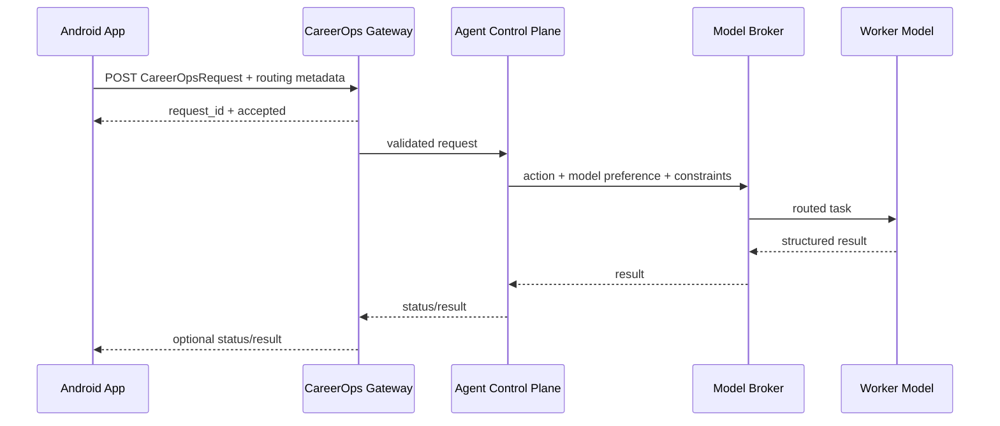

# CareerOps Share — Architecture and Design

## Purpose

CareerOps Share is the Android intake and routing edge for CareerOps. It receives content explicitly shared by the user, normalizes job metadata, applies an optional routing preset, creates a versioned CareerOps request, renders it for the selected destination, and dispatches it through a transport abstraction.

The application separates:

1. **What CareerOps should do** — `CareerOpsAction`
2. **What routing configuration should be applied** — `CareerOpsPreset`
3. **What request is being sent** — `CareerOpsRequest`
4. **How that request is represented** — `RequestProfile` / `CareerOpsRequestRenderer`
5. **Where the request goes** — `DestinationProfile`
6. **How it gets there** — `CareerOpsTransport`
7. **Which model should ultimately execute work** — `ModelPreference`, enforceable later by the CareerOps control plane

This prevents the Android application from being coupled to one AI vendor, one Android app, one request representation, or one worker model.

## v0.3 architecture



## Presets

`CareerOpsPreset` is the central v0.3 routing object.

```text
CareerOpsPreset
├── id
├── name
├── CareerOpsAction
├── destinationId
├── ModelPreference
├── RequestProfile
├── autoForward
└── showInDirectShare
```

v0.3 initially provides three stable preset identities:

- `quick-analyze`
- `build-store`
- `full-application`

The identities are intentionally stable because Android Sharing Shortcuts use the preset ID as the shortcut ID.

### Storage

The first implementation stores preset overrides in the existing private `SharedPreferences` file. A v0.2 compatibility migration seeds the Quick Analyze preset from the previous saved action/destination.

The repository isolates persistence behind `AppPreferences`, allowing a later move to DataStore when arbitrary user-created presets, renaming, ordering or richer schemas justify structured storage.

## Direct Share

Android 10+ Direct Share is implemented through the Sharing Shortcuts API.

`res/xml/shortcuts.xml` declares a `share-target` for `text/*` and a CareerOps preset category. `DirectShareShortcutPublisher` publishes enabled dynamic shortcuts with matching categories.

When a Direct Share target is selected, Android sends the original `ACTION_SEND` to `MainActivity` with:

```text
android.intent.extra.shortcut.ID = <preset-id>
```

`MainActivity` resolves the preset and invokes the router **before constructing the editor UI**. A successful route finishes the CareerOps activity after launching the destination. A failed route falls through to the interactive editor with the original shared content preserved.

This is a routing/trampoline behavior even though Android still invokes an Activity as the share target.

## Normal-share auto-forward

The ordinary CareerOps Share app target remains the safe review path by default.

The user can explicitly enable normal-share auto-forward. In that mode:

```text
ACTION_SEND
→ load default preset
→ IncomingShareReader
→ ShareParser
→ CareerOpsRoutePlanner
→ renderer
→ transport
```

If routing fails, the app opens the editor rather than discarding the incoming share.

## Intake

`IncomingShareReader` owns Android Intent extraction. `ShareParser` remains Android-independent and owns source/job detection and canonicalization.

This boundary keeps Android framework logic out of parsing tests and allows future non-Android intake sources to reuse parser/request logic.

## Route planning

`CareerOpsRoutePlanner` is Android-independent. Given a `JobShareIntake` and `CareerOpsPreset`, it produces a `CareerOpsRoutePlan` containing:

- the resolved preset,
- `CareerOpsRequest`,
- `DestinationProfile`,
- rendered payload.

This makes routing decisions testable without launching Android activities.

## Request contract

`CareerOpsRequest` remains transport-neutral at schema version `1.0`.

Preset destination and model preference are routing concerns and are not injected into schema v1.0 simply to satisfy the mobile UI. This avoids unnecessary coupling between mobile-release cadence and the CareerOps execution contract.

## Request profiles

v0.3 introduces `RequestProfile` as a renderer-selection boundary.

Initial profiles:

- `careerops_standard` → existing compatibility text beginning with `Analyze this job using CareerOps:`
- `careerops_json` → structured JSON representation

A future HTTP transport can select structured request profiles without changing the intake or preset model.

## Destinations and model routing

`DestinationProfile` still describes where/how the request leaves Android.

Enabled local destinations:

- ChatGPT Android
- Android system chooser

The future CareerOps Gateway remains defined but disabled.

`ModelPreference` is stored independently from destination. For normal Android chat-app targets, the capability is `DESTINATION_DEFAULT`: CareerOps Share cannot guarantee which internal model the destination application uses.

The future Gateway can advertise `ENFORCED` model-routing capability and honor the same preset preference server-side.

## Transports

`CareerOpsTransport` remains the delivery interface.

v0.3 implements:

- `AndroidAppTransport`
- `AndroidChooserTransport`

`TransportType.HTTP_POST` remains a forward-compatible contract only. No network transport is registered in v0.3.

## Security boundary

v0.3 remains local-only:

- no `INTERNET` permission,
- no API keys,
- no GitHub token,
- no model-provider credentials,
- no background network activity,
- no direct repository mutation.

Direct Share changes interaction speed, not the application's trust boundary.

## Stable signing boundary

Stable release signing is independent from feature routing.

v0.2.1 established the permanent release certificate. v0.3 development uses normal debug CI; signed RC/final releases must continue through the guarded permanent-key workflows and must match the established signer fingerprint.

## Future Gateway design



## Versioning

Three version concepts are deliberately independent:

- Android application version — v0.3 development is `0.3.0`
- CareerOps request schema — currently `1.0`
- preset storage/schema — internal Android persistence contract, currently not externally versioned
