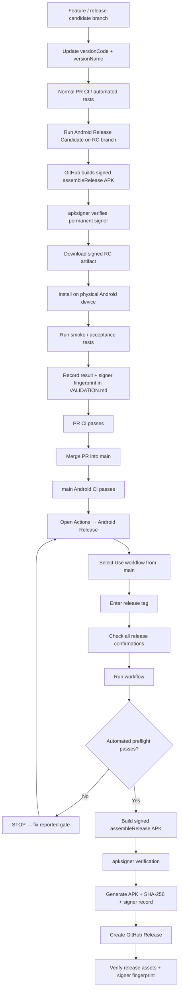

# CareerOps Share — Release Candidate Finalization

Use this checklist **before** starting the **Android Release** workflow in GitHub Actions.

Beginning with the stable-signing transition release, GitHub Releases must contain a permanently signed **release APK**, not a debug APK. See [`SIGNING.md`](SIGNING.md).

## Release flow



## One-time stable-signing transition

The v0.1.1/v0.2.0 lineage was debug-signed. The first permanently signed release establishes a new signing identity.

For that first stable-signed candidate only:

- [ ] Back up the permanent keystore in at least two secure locations.
- [ ] Configure the four GitHub signing secrets from `docs/SIGNING.md`.
- [ ] Run **Android Release Candidate** and record the signer SHA-256 fingerprint.
- [ ] Uninstall the old debug-signed CareerOps Share app from the device if Android rejects the signature change.
- [ ] Install the signed RC APK fresh.
- [ ] Confirm the signed RC works before merging/releasing.

After the transition, future stable-signed releases should install as normal upgrades as long as the same permanent keystore is used.

## Human release checklist

Complete these in order.

- [ ] **Version finalized.** `app/build.gradle.kts` contains the intended `versionCode` and `versionName`.
- [ ] **Normal automated tests/build passed** for the release candidate.
- [ ] **Signed RC workflow passed.** `Android Release Candidate` built `assembleRelease` successfully.
- [ ] **Signer fingerprint verified.** The RC workflow's certificate SHA-256 matches the permanent keystore fingerprint.
- [ ] **Physical-device install passed** using the signed RC artifact.
- [ ] **Physical-device smoke/acceptance test passed.** Critical Sharesheet and destination behavior works.
- [ ] **`VALIDATION.md` updated** with the release-candidate result for this exact version and signer fingerprint.
- [ ] **Release PR merged into `main`.**
- [ ] **Android CI on `main` is green** for the merged commit.
- [ ] **Release notes/changelog reviewed** and documentation is current.
- [ ] **Android Release form uses `main`** in the `Use workflow from` selector.
- [ ] **Release tag matches `versionName`**, including the leading `v` on the tag. Example: app `0.2.1` → tag `v0.2.1`.
- [ ] **Stable-signing confirmation checked** on the Android Release form.

## Quick verification commands — PowerShell

Run these from the repository root.

### 1. Confirm local repository state

```powershell
git status
git branch --show-current
git remote -v
```

Do not commit generated output or signing material.

### 2. Refresh remote state

```powershell
git fetch origin --prune
```

### 3. Confirm candidate version

```powershell
git show HEAD:app/build.gradle.kts | Select-String 'versionCode|versionName'
```

Expected shape:

```text
versionCode = <next integer>
versionName = "X.Y.Z"
```

### 4. Verify the permanent keystore fingerprint locally

```powershell
keytool -list -v `
  -keystore "$env:USERPROFILE\.careerops\signing\careerops-share-release.p12" `
  -alias careerops-share-release
```

Compare the SHA-256 certificate fingerprint with the **Android Release Candidate** job summary.

### 5. Run ordinary local debug tests if desired

```powershell
.\gradlew.bat clean test assembleDebug
```

A debug build is useful for development, but it is **not** the release artifact.

### 6. Test the signed release candidate

Run:

**GitHub → Actions → Android Release Candidate → Run workflow**

Select the release-candidate branch in **Use workflow from**.

After it succeeds, download the `careerops-share-vX.Y.Z-signed-rc` artifact and extract the APK.

List ADB targets:

```powershell
adb devices
```

If only one target is connected:

```powershell
adb install -r .\CareerOpsShare-vX.Y.Z-signed-rc.apk
```

If multiple devices/emulators are present:

```powershell
adb -s <DEVICE_ID> install -r .\CareerOpsShare-vX.Y.Z-signed-rc.apk
```

For the first stable-signing migration, if Android reports a signature mismatch, uninstall the old debug lineage first:

```powershell
adb uninstall com.careerops.share
adb install .\CareerOpsShare-vX.Y.Z-signed-rc.apk
```

That uninstall is expected only when crossing from the old debug certificate to the new permanent signing certificate.

## GitHub UI checks

### Pull request

Confirm:

- PR is merged, not merely closed.
- normal Android CI is green.
- signed RC workflow was green for the tested candidate.
- intended version files and documentation are included.

### `main` CI

Open **Actions → Android CI** and confirm the newest run for `main` and the release-candidate merge commit is green.

### Release form

Open **Actions → Android Release → Run workflow**.

Before pressing **Run workflow**:

1. Set **Use workflow from** to `main`.
2. Enter the release tag, e.g. `v0.2.1`.
3. Check every confirmation box, including stable signing.
4. Only then start the workflow.

## What the release workflow verifies automatically

The guarded release workflow independently checks:

- run started from current `main`,
- checked-out `HEAD` equals current `origin/main`,
- every required human confirmation is true,
- release tag has valid semantic-version form,
- tag version matches Android `versionName`,
- `versionCode` is present and numeric,
- `VALIDATION.md` contains a section for the release version,
- an existing tag with the same name does not point elsewhere,
- all four stable signing secrets exist,
- the temporary PKCS12 keystore opens with the configured alias,
- Gradle tests pass,
- `assembleRelease` completes using the permanent signing configuration,
- Android `apksigner` verifies the APK,
- signer SHA-256 fingerprint is extracted and reported,
- APK SHA-256 checksum is generated before publication.

If any preflight/signing/build gate fails, **the release is not published**.

## Post-release verification

After the workflow is green, open **Releases** and verify:

- [ ] Release title/tag is correct.
- [ ] Signed APK asset exists: `CareerOpsShare-vX.Y.Z.apk`.
- [ ] SHA file exists: `CareerOpsShare-vX.Y.Z.apk.sha256`.
- [ ] Signing certificate record exists: `CareerOpsShare-vX.Y.Z-signing-certificate.txt`.
- [ ] Release points to the intended `main` commit.
- [ ] Signer SHA-256 fingerprint matches the permanent key and tested RC.
- [ ] Install the released APK and run one final smoke test when practical.

## Release discipline

- Do **not** commit generated APKs into Git history.
- Do **not** commit keystores, base64 keystore material, or signing passwords.
- Do **not** manually create the release tag before Actions unless there is a specific reason.
- Do **not** run Android Release from a feature branch.
- Do **not** publish debug APKs in the normal stable release channel.
- Do **not** change the permanent signing key between ordinary releases.
- Do **not** bump the version again between signed RC validation and release unless the candidate is rebuilt/revalidated.
- If a workflow fails, fix the reported gate instead of bypassing it.
