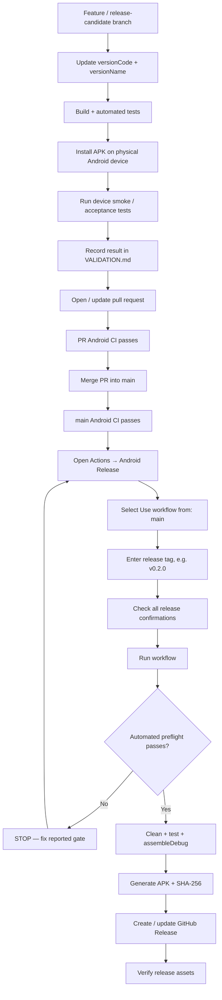

# CareerOps Share — Release Candidate Finalization

Use this checklist **before** starting the **Android Release** workflow in GitHub Actions.

The release workflow is intentionally fail-safe. It should only publish after the release candidate has been tested, documented, merged into `main`, and confirmed green.

## Release flow



## Human release checklist

Complete these in order.

- [ ] **Version finalized.** `app/build.gradle.kts` contains the intended `versionCode` and `versionName`.
- [ ] **Automated tests/build passed** for the release candidate.
- [ ] **Physical-device install passed.** The candidate APK installs/upgrades on the target Android device.
- [ ] **Physical-device smoke/acceptance test passed.** Critical Sharesheet and destination behavior works.
- [ ] **`VALIDATION.md` updated** with the release-candidate result for this exact version.
- [ ] **Release PR merged into `main`.**
- [ ] **Android CI on `main` is green** for the merged commit.
- [ ] **Release notes/changelog reviewed** and documentation is current.
- [ ] **Android Release form uses `main`** in the `Use workflow from` selector.
- [ ] **Release tag matches `versionName`**, including the leading `v` on the tag. Example: app `0.2.0` → tag `v0.2.0`.

## Quick verification commands — PowerShell

Run these from the repository root.

### 1. Confirm local repository state

```powershell
git status
git branch --show-current
git remote -v
```

Before final release work, avoid committing generated output such as `app/build/`.

### 2. Refresh remote state

```powershell
git fetch origin --prune
```

### 3. Confirm what is on `main`

```powershell
git log origin/main -1 --oneline
git show origin/main:app/build.gradle.kts | Select-String 'versionCode|versionName'
```

Expected shape:

```text
versionCode = <next integer>
versionName = "X.Y.Z"
```

The release tag must be:

```text
vX.Y.Z
```

### 4. Confirm validation is recorded

```powershell
git show origin/main:VALIDATION.md | Select-String '## vX.Y.Z|Release gate|Physical-device validation'
```

Replace `X.Y.Z` with the candidate version.

### 5. Optional local build verification

```powershell
.\gradlew.bat clean test assembleDebug
```

Expected APK:

```text
app\build\outputs\apk\debug\app-debug.apk
```

### 6. Optional physical-device reinstall

List targets:

```powershell
adb devices
```

If only one device is connected:

```powershell
adb install -r .\app\build\outputs\apk\debug\app-debug.apk
```

If multiple devices/emulators are present:

```powershell
adb -s <DEVICE_ID> install -r .\app\build\outputs\apk\debug\app-debug.apk
```

## GitHub UI checks

### Pull request

Open the release PR and confirm:

- PR is merged, not merely closed.
- Android CI check is green.
- The intended version files and documentation are included.

### `main` CI

Open:

**Actions → Android CI**

Confirm the newest run for branch `main` and the release-candidate merge commit is green.

### Release form

Open:

**Actions → Android Release → Run workflow**

Before pressing **Run workflow**:

1. Set **Use workflow from** to `main`.
2. Enter the release tag, e.g. `v0.2.0`.
3. Check every confirmation box.
4. Only then start the workflow.

## What the workflow verifies automatically

The release workflow independently checks:

- the run was started from `main`,
- checked-out `HEAD` equals current `origin/main`,
- every required human confirmation is `true`,
- the release tag has valid semantic-version form,
- the tag version matches Android `versionName`,
- `versionCode` is present and numeric,
- `VALIDATION.md` contains a section for the release version,
- an existing tag with the same name does not point to a different commit,
- Gradle tests pass,
- the debug APK builds successfully,
- a SHA-256 checksum is generated before publication.

If any preflight gate fails, **the release is not published**.

## Post-release verification

After the workflow is green, open **Releases** and verify:

- [ ] Release title/tag is correct.
- [ ] APK asset exists: `CareerOpsShare-vX.Y.Z-debug.apk`.
- [ ] SHA file exists: `CareerOpsShare-vX.Y.Z-debug.apk.sha256`.
- [ ] Release points to the intended `main` commit.
- [ ] Optional: install the released APK asset and run one final smoke test.

## Release discipline

- Do **not** commit generated APKs into Git history.
- Do **not** manually create the release tag before the Actions release unless there is a specific reason. The release workflow can create the tag at the validated `main` commit.
- Do **not** run Android Release from a feature branch.
- Do **not** bump the version again between physical validation and release unless the candidate is rebuilt/revalidated.
- If a release workflow fails, read the failed preflight/build step first. Do not bypass a guard merely to make the workflow green.
