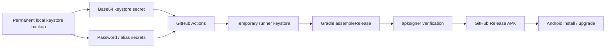

# CareerOps Share — Stable Release Signing

CareerOps Share uses one permanent signing identity for every GitHub Release APK beginning with the stable-signing transition release.

The private signing key must never be committed to Git. GitHub Actions receives the keystore and passwords only through repository Actions secrets and injects them into the release build as environment variables.

## Why this is required

Android only allows an installed app to be upgraded by another APK signed with the same signing certificate. The earlier v0.1.1/v0.2.0 development releases were debug-signed, so they are not a suitable permanent distribution lineage.

The first stable-signed APK establishes the permanent CareerOps Share signing identity. Every later release must use the same keystore and alias.

> **One-time migration:** an existing debug-signed CareerOps Share install will normally need to be uninstalled before installing the first stable-signed release. After that transition, later stable-signed releases can upgrade normally.

## Signing architecture



The GitHub runner deletes its temporary copy when the job ends. The permanent source of truth is the backed-up keystore you control.

## Repository secret names

Create these four GitHub Actions repository secrets exactly:

- `CAREEROPS_RELEASE_KEYSTORE_B64`
- `CAREEROPS_RELEASE_STORE_PASSWORD`
- `CAREEROPS_RELEASE_KEY_ALIAS`
- `CAREEROPS_RELEASE_KEY_PASSWORD`

The setup helper uses alias `careerops-share-release` by default. For the generated PKCS12 keystore, using the same password for the keystore and key is expected.

## Recommended one-time setup — Windows PowerShell

From the repository root on your trusted Windows machine:

```powershell
.\scripts\setup-release-signing.ps1 -ConfigureGitHubSecrets
```

The helper will:

1. create a PKCS12 keystore outside the repository under `%USERPROFILE%\.careerops\signing\`,
2. use a 4096-bit RSA key with long validity,
3. display the signing certificate fingerprint,
4. optionally configure the four GitHub repository secrets through the authenticated GitHub CLI (`gh`).

When `keytool` prompts for a key password, press **Enter** to use the same password as the keystore password.

If `gh` is not installed/authenticated, run the helper without `-ConfigureGitHubSecrets`, then add the secrets manually in:

**GitHub repository → Settings → Secrets and variables → Actions → New repository secret**

To produce the base64 keystore value manually in PowerShell:

```powershell
$path = "$env:USERPROFILE\.careerops\signing\careerops-share-release.p12"
[Convert]::ToBase64String([IO.File]::ReadAllBytes($path)) | Set-Clipboard
```

Paste that clipboard value into `CAREEROPS_RELEASE_KEYSTORE_B64`.

## Back up the keystore

The keystore is effectively part of the app's identity. If it is lost, future APKs cannot update installations signed with it.

Keep at least two secure copies, for example:

- primary encrypted local backup,
- secondary encrypted offline/cloud backup.

Do not store the keystore, passwords, or plaintext base64 value in the repository, issue tracker, documentation, chat logs, or release assets.

## Validate GitHub signing before publishing

After the repository secrets exist, run:

**Actions → Android Release Candidate → Run workflow**

Choose the release-candidate branch in **Use workflow from**.

The workflow builds a signed release APK without creating a tag or GitHub Release. It verifies the APK with Android `apksigner` and uploads the signed APK as a short-lived Actions artifact for physical-device testing.

For the first stable-signing migration:

1. uninstall the old debug-signed CareerOps Share app,
2. install the signed release-candidate APK,
3. run the normal device acceptance tests,
4. record the result in `VALIDATION.md`,
5. merge the release candidate to `main`,
6. confirm `main` CI is green,
7. run the guarded **Android Release** workflow.

## Gradle environment contract

The release build reads these environment variables:

```text
CAREEROPS_RELEASE_STORE_FILE
CAREEROPS_RELEASE_STORE_PASSWORD
CAREEROPS_RELEASE_KEY_ALIAS
CAREEROPS_RELEASE_KEY_PASSWORD
```

GitHub Actions creates `CAREEROPS_RELEASE_STORE_FILE` from the base64 keystore secret at runtime. Passwords and alias are supplied directly from repository secrets.

`assembleDebug` does not require release signing configuration. `assembleRelease` is guarded so a release build does not silently proceed without the signing environment.

## Verify a local keystore fingerprint

```powershell
keytool -list -v `
  -keystore "$env:USERPROFILE\.careerops\signing\careerops-share-release.p12" `
  -alias careerops-share-release
```

Record the SHA-256 certificate fingerprint somewhere secure. GitHub Actions also reports the signer SHA-256 fingerprint in the job summary so you can compare releases over time.

## Signing invariants

Once the first stable-signed release ships:

- never replace the keystore for normal releases,
- never change the alias unless performing an intentional signing-key migration,
- never publish an APK signed with an unrelated debug key under the normal release channel,
- every GitHub Release APK must pass `apksigner verify`,
- the signer SHA-256 fingerprint should remain constant across releases.
